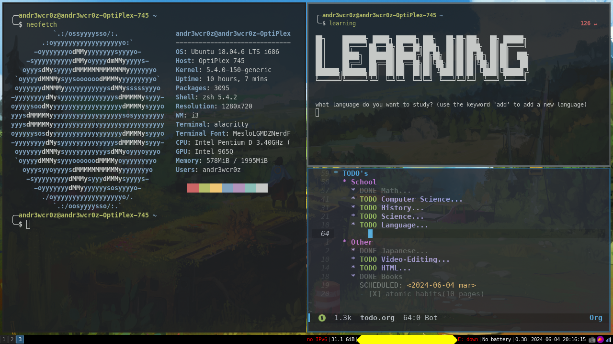

# DOTFILES
---
# Linux (Kubuntu)

## Here are most of my configurations!

# I use Doom Emacs for studying at the moment.

### I use both Vim and Neovim

### Each have their own purposes (although very similar, different)
- **Neovim serves as a code editor for me when I'm going to code for a prolonged period of time**
# Screenshots of my setup in i3 (not necessarily updated)

### I no longer use alacritty (I use kitty nowadays, and yes this is someone else's config for kitty)
---
# MacOS

### Most configurations are the same as they are in linux 

## Screenshot of my setup in MacOS (not necessarily updated)

### I currently have a setup of two computers, A 15" 2014 Macbook Pro as my primary, and an Optiplex 745 as my secondary PC 
