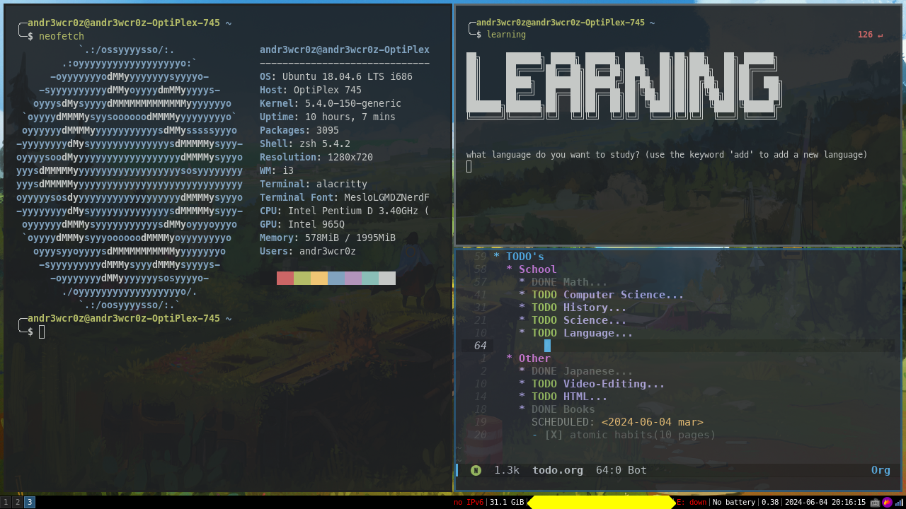

# dotfiles

## Here are most of my configurations!

# I use Doom Emacs for studying at the moment.

### I use both Vim and Neovim

### Each have their own purposes (although very similar, different)
- **Neovim serves as a code editor for me when I'm going to code for a prolonged period of time**
- **Vim also serves as a code editor for me. The only difference being that I only use vim for when I'm going to be quick. BTW this README is being edited in Vim**
---
# Screenshots of my setup in i3 (not necessarily updated)

### I no longer use alacritty (I use kitty nowadays, and yes this is someone else's config for kitty)
