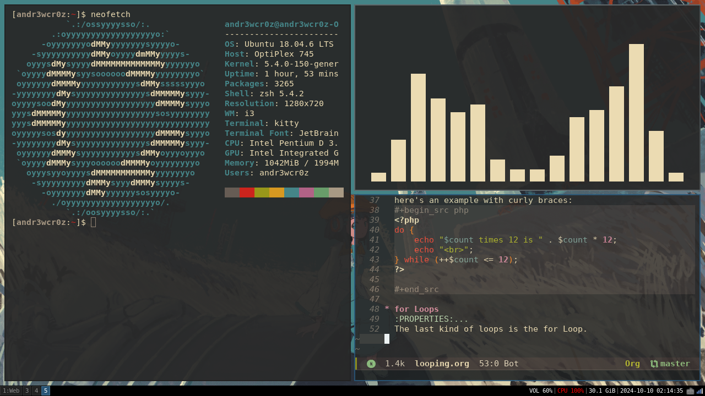
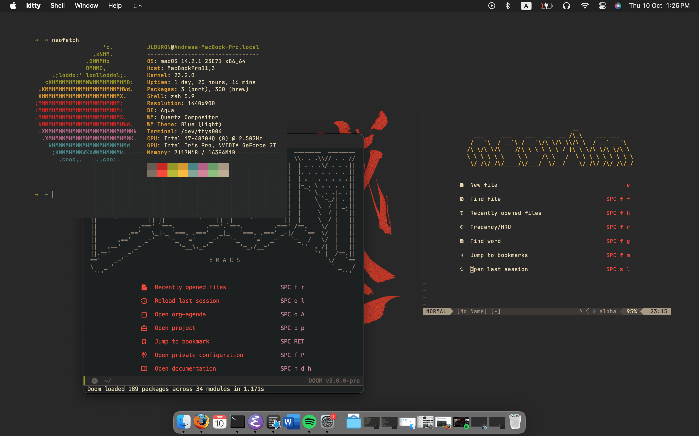

# DOTFILES
---
# Linux (Kubuntu)

## Here are most of my configurations!
# How I use somethings:
- **Neovim serves as a code editor for me when I'm going to code**

- **Emacs serves as note taking software as well as my calendar/todo keeper**

# Screenshots of my setup in i3 (not necessarily updated)

### My current main terminal is Kitty
---
# MacOS

### Most configurations are the same as they are in linux 

## Screenshot of my setup in MacOS (not necessarily updated)

# How I use somethings:
- **I use Nvim and Emacs the same way I do in linux**

### My current main terminal is Kitty

### I currently have a setup of two computers, A 15" 2014 Macbook Pro as my primary, and an Optiplex 745 as my secondary PC 
